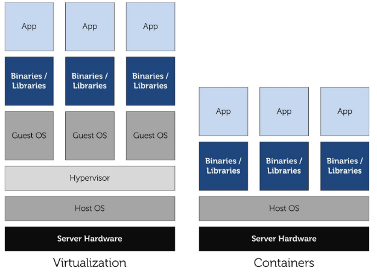
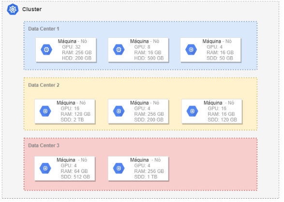
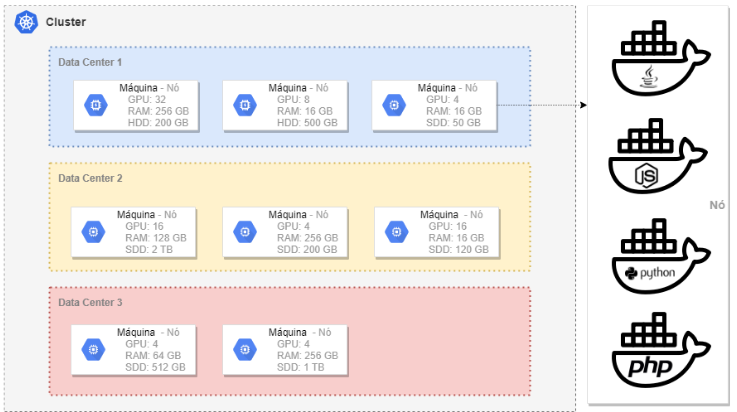
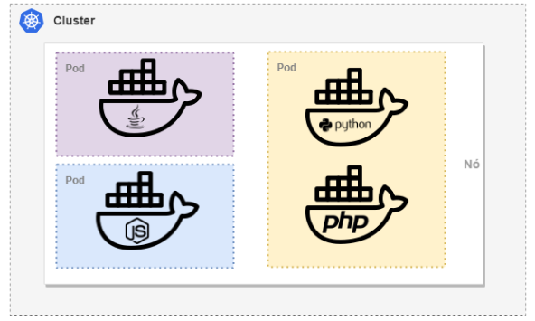
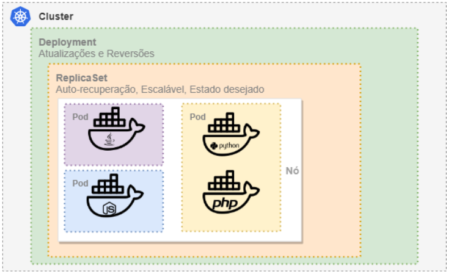
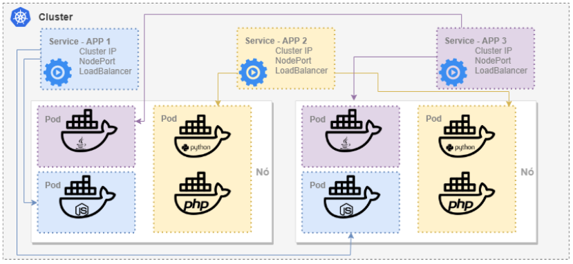
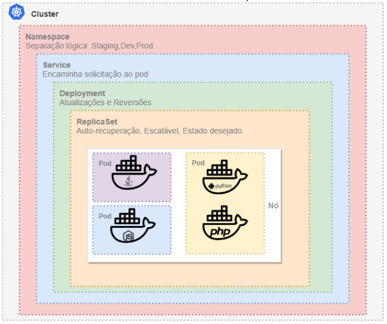

# Introdução ao Kubernetes

## [Containers](https://www.docker.com/resources/what-container)

Antes de falarmos sobre o kubernetes, vamos falar um pouco sobre containers 

Você já deve estar familiarizado com os containers(Docker). Caso esteja pode pular para o próximo passo (O que é o kubernetes), caso não esteja, não se desespere irei falar um pouco sobre ele.

Container nada mais é do que um ambiente isolado contido em um servidor. Os containers proporcionam uma maneira padrão de empacotar código, configurações e dependências de seu aplicativo em um único objeto. Eles compartilham recursos com o servidor e são executados como processos isolados de recursos, para exemplificar vamos imaginar um navio cargueiro com vários containers dentro. Se um produto dentro de um container se danificar, não afetará os outros containers ou o navio, pois cada um está isolado e protegido.

Em vez de configurar uma máquina para hospedar seu aplicativo, você o coloca em um contêiner (junto com tudo o que seu aplicativo precisa - SO, bibliotecas, dependências, etc.). Uma vez conteinerizados, os aplicativos podem ser implantados em qualquer infraestrutura. Sejam elas máquinas virtuais, bare-metal ou várias nuvens, isso permite fazer implantações rápidas, confiáveis e consistentes, independentemente do ambiente.

### Maquinas virtuais vs Contaners

Diferente das maquinas virtuais os containers compartilham recursos com o servidor fisico, dispensando o uso do hypervisor para uma nova instalação do S.O.

Ao utilizar o compartilhamento de kernel, os containers geram uma de economia de recursos, comparada a utilização de maquinas virtuais.

## [O que é kubernetes](https://kubernetes.io/docs/concepts/overview/what-is-kubernetes/)

Kubernetes (K8s) é um sistema de orquestração de contêiners open-source que automatiza a implantação, o dimensionamento e a gestão de aplicações em contêiners. Ele foi originalmente projetado pelo Google e agora é mantido pela Cloud Native Computing Foundation. Ele funciona com uma variedade de ferramentas de conteinerização, incluindo Docker.

Kubernetes é uma tecnologia de cluster. Isso significa que você verá um cluster de computadores como uma entidade. Você não implantará um aplicativo em um computador específico, mas em algum lugar do cluster. As maquinas do cluster podem ter características diferentes e o trabalho do Kubernetes é determinar qual o  computador(node) que melhor atenda aos requisitos do seu aplicativo.

Como o Kubernetes adora camadas, existem termos para determinadas funções dentro do kubernetes

## [Nodes](https://kubernetes.io/docs/concepts/overview/components/#node-components)

Cada computador no cluster é chamado de nó. Eventualmente, os nós hospedarão seus aplicativos. Os nós podem se espalhar por todo o mundo em diferentes datacenters (Azure, AWS, Google Cloud) e é função do Kubernetes fazê-los se comunicar como se fossem vizinhos.

## [Pods](https://kubernetes.io/docs/concepts/workloads/pods/pod/)

O Kubernetes adiciona a noção de Pods ao redor de seus contêineres. Os pods são a menor unidade que você implantará no cluster. O Pod não costuma andar sozinho um único Pod pode conter vários contêineres. Por estarem juntos, é garantido que esses containers compartilhem os mesmos recursos.

## [Deployment](https://kubernetes.io/docs/concepts/workloads/controllers/deployment/) e [ReplicaSet](https://kubernetes.io/docs/concepts/workloads/controllers/replicaset/)

Aqui vem a parte divertida! os Deployments são os requisitos que você fornece ao Kubernetes em relação aos seus aplicativos(Pods). Basicamente, no deployment, você informa ao Kubernetes: 
* Ei, Kube, mantenha sempre 2 instâncias desses Pods em execução.

Solicitado o Deploy, o Kubernetes imediatamente cria um ReplicaSet o trabalho dele é garantir que seu cluster hospede 2 réplicas dos seus Pods a qualquer momento,Não se preocupe em manter ou alterar um ReplicaSet, elas são controladas pelo próprio deployment considere então o ReplicaSet um recurso operacional do Deployment.

## [Services](https://kubernetes.io/docs/concepts/services-networking/service/)

Ah, mais um conceito divertido ...
O ciclo de vida dos pods é irregular; eles vêm e vão pela vontade de Kubernetes.
* Não saudável? Morto.
* Não está no lugar certo? Clonado e morto.

Então, como você pode enviar uma solicitação para seu aplicativo se não sabe ao certo onde ele mora? A resposta está nos serviços.
Os serviços definem conjuntos de seus Pods implantados, para que você possa enviar uma solicitação ao pod disponível.

Exitem 3 tipos de serviços no kubernetes: 

1. ClusterIP
Um serviço ClusterIP é o serviço Kubernetes padrão. Oferece um serviço dentro do cluster que outros aplicativos dentro do cluster podem acessar. Não há acesso externo

2. NodePort 
Um serviço NodePort é a maneira mais primitiva de obter tráfego externo diretamente para o seu serviço. NodePort, como o nome indica, abre uma porta específica em todos os Nós e qualquer tráfego enviado a essa porta é encaminhado para o serviço. Você só poderá utilizar o range de portas de 30000 á 32767 qualquer outra porta fora desse range, não irá funcionar.

3. LoadBalance
Um serviço LoadBalancer é a maneira padrão de expor um serviço à Internet. No nosso lab, isso ativará um Balanceador de Carga de Rede que fornecerá um único endereço IP que encaminhará todo o tráfego para o serviço.

## [Namespaces](https://kubernetes.io/docs/concepts/overview/working-with-objects/namespaces/)

É a segregação lógica de nosso cluster, permitem criar divisões de 'ambientes' dentro do nosso cluster.
O que nos possibilita, por exemplo, ter N ambientes lógicos como Desenvolvimento, Homologação e Produção, ou seja, são fatias de nosso cluster físico.
Tudo vive dentro de um namespace, os recursos do kubernetes nascem no namespace kube-system, e para nós, (caso nenhum namespaces seja definido) tudo será enviado ao namespaces default.

## [Ingress](https://kubernetes.io/docs/concepts/services-networking/ingress/)

Portanto, temos os **pods** em nosso cluster. Temos os **serviços** para que possamos conversar com eles de dentro do cluster. Agora, gostaríamos de expor os serviços à internet para que os clientes possam acessar nossos produtos.

O ingress é um objeto de API que gerencia o acesso externo aos serviços em um cluster, geralmente HTTP. O Ingress pode fornecer balanceamento de carga, terminação SSL e hospedagem virtual baseada em nome. O Ingress expõe rotas HTTP e HTTPS de fora do cluster para serviços dentro do cluster. O roteamento de tráfego é controlado pelas regras definidas no recurso do Ingress. 

É importante saber que o ingress necessita um controller para funcionar, e temos a opção de escolher o nosso, dentre várias opções de implementação.

Nós seguiremos com o traefik em nosso lab, por ser uma ferramenta extremamente versátil, completa e bem pontuada

